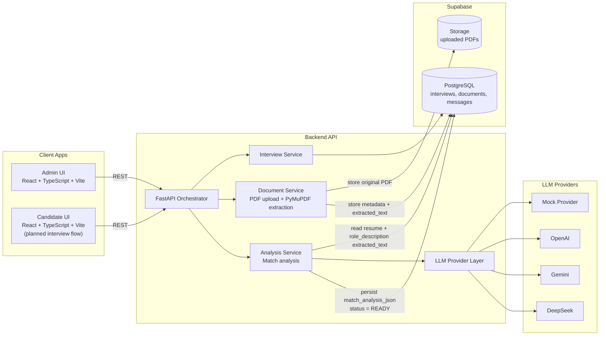

# AI Interviewer Chatbot (MVP)

A local-first MVP for running adaptive, AI-assisted technical interviews.

This project is being built step-by-step from the blueprint in `docs/AI-Interview-Chatbot-Blueprint 2.pdf`, using:

- Frontend: React + TypeScript + Vite
- Backend: FastAPI + Python
- Database: Supabase PostgreSQL
- Storage: Supabase Storage
- LLM: Pluggable multi-provider (Mock, OpenAI, Gemini, DeepSeek)

## Vision

The intended end-to-end flow is:

1. Admin creates interview
2. Admin uploads resume and role description
3. Backend extracts text and runs match analysis
4. Candidate starts interview session
5. System asks adaptive questions
6. Candidate answers are scored with a rubric
7. Difficulty adjusts over time
8. Final report is generated

This MVP emphasizes deterministic orchestration around LLM calls, structured JSON outputs, and persistence of interview transcripts and scoring metadata.

## Current Status

Implemented now:

- Backend skeleton with FastAPI
- Health endpoint: `GET /health`
- Backend CORS for local frontend origins
- Environment-driven backend configuration via `.env`
- Supabase client wiring in backend
- Interview endpoints:
  - `POST /interviews`
  - `GET /interviews`
  - `GET /interviews/{interview_id}`
  - `DELETE /interviews/{interview_id}`
- Supabase schema SQL file: `docs/supabase_schema.sql`
- Frontend skeleton with route structure and placeholder pages
- Frontend API client configured via `VITE_API_URL`
- Admin create-interview form (title, target questions, starting difficulty)
- Redirect from `/admin` to `/admin/interviews/:id` after successful creation
- Document upload endpoint with PDF extraction:
  - `POST /interviews/{interview_id}/documents`
- Document listing endpoints:
  - `GET /interviews/{interview_id}/documents` (from DB)
  - `GET /interviews/{interview_id}/documentsFromStorage` (from Storage)
- Document delete endpoint:
  - `DELETE /interviews/{interview_id}/documents/{filename}`
- LLM Match analysis endpoint:
  - `POST /interviews/{interview_id}/analyze`
- Frontend upload UI for resume and role description PDFs with upload status
- Frontend interview-title dropdown on interview details page
- Upload errors surfaced with backend-friendly messages
- Frontend analysis button rendering structured match JSON output

Not implemented yet (planned):

- Interview loop (start, answer, next-question)
- Scoring + difficulty adaptation
- Final report generation
- Docker setup for local orchestration

## Architecture (MVP)



## Repository Layout

```text
ai-interviewer-chatbot/
├── AGENTS.md
├── README.md
├── api/
│   ├── README.md
│   ├── requirements.txt
│   ├── .env.example
│   └── app/
│       ├── main.py
│       ├── config.py
│       ├── schemas.py
│       ├── llm.py
│       ├── interview_service.py
│       ├── document_service.py
│       ├── analysis_service.py
│       └── providers/
│           ├── base.py
│           ├── mock.py
│           ├── openai_provider.py
│           ├── gemini_provider.py
│           └── deepseek_provider.py
├── frontend/
│   ├── README.md
│   ├── package.json
│   ├── .env.example
│   └── src/
│       ├── App.tsx
│       ├── api/client.ts
│       └── pages/
└── docs/
    └── AI-Interview-Chatbot-Blueprint 2.pdf
```

## Prerequisites

- Python 3.10+
- Node.js 18+
- npm 9+

## Quick Start (Local)

### 1) Start the API

```bash
cd api
python -m venv .venv
source .venv/bin/activate
pip install -r requirements.txt
cp .env.example .env
uvicorn app.main:app --reload
```

API runs at: `http://localhost:8000`

Health check:

```bash
curl http://localhost:8000/health
```

Expected response:

```json
{"status":"ok"}
```

### 2) Start the Frontend

Open a second terminal:

```bash
cd frontend
npm install
cp .env.example .env
npm run dev
```

Frontend typically runs at: `http://localhost:5173`

## Environment Variables

### API (`api/.env`)

Based on `api/.env.example`:

- `SUPABASE_URL=`
- `SUPABASE_SERVICE_ROLE_KEY=`
- `LLM_PROVIDER=mock`
- `OPENAI_API_KEY=`
- `OPENAI_MODEL=gpt-4o-mini`
- `GOOGLE_API_KEY=`
- `GOOGLE_MODEL=gemini-2.0-flash`
- `DEEPSEEK_API_KEY=`
- `DEEPSEEK_MODEL=deepseek-chat`

Note: these are scaffolded now and will be used in upcoming steps.

### Frontend (`frontend/.env`)

Based on `frontend/.env.example`:

- `VITE_API_URL=http://localhost:8000`

## Available Routes and Endpoints

### Backend

- `GET /health` -> returns service health
- `POST /interviews` -> creates interview
- `GET /interviews` -> lists interviews
- `GET /interviews/{interview_id}` -> fetches interview
- `DELETE /interviews/{interview_id}` -> deletes interview
- `POST /interviews/{interview_id}/documents` -> uploads PDF and returns extracted character count
- `GET /interviews/{interview_id}/documents` -> lists documents from `documents` table
- `GET /interviews/{interview_id}/documentsFromStorage` -> lists documents from Supabase Storage
- `DELETE /interviews/{interview_id}/documents/{filename}` -> deletes document from Storage + DB
- `POST /interviews/{interview_id}/analyze` -> triggers LLM match analysis and returns structured JSON

### Frontend

- `/admin`
- `/admin/interviews/:id`
- `/interview/:id`

## Product Workflow (Blueprint-Aligned)

Target state machine:

- `DRAFT` -> `READY` -> `IN_PROGRESS` -> `COMPLETED`

Planned core workflows:

1. Create + analyze interview
2. Run adaptive interview loop
3. Generate final report

The implementation roadmap is defined in `AGENTS.md` (Steps 1-11).

## Development Notes

- Keep the MVP simple; avoid premature abstraction.
- Favor strict JSON contracts for LLM outputs.
- Persist transcripts and scoring metadata for report generation.
- Treat integrity signals (`response_time_ms`, `paste_detected`) as informational, not automatic disqualifiers.

## Documentation

- Blueprint: `docs/AI-Interview-Chatbot-Blueprint 2.pdf`
- Backend notes: `api/README.md`
- Frontend notes: `frontend/README.md`
- Step-by-step implementation plan: `AGENTS.md`

## Next Milestones

1. Interview start + answer scoring loop
2. Final report generation
3. Dockerize API + frontend for local runs

## Current document behavior

- Uploaded document filenames are normalized to `snake_case` before storing.
- Upload stores file in Supabase Storage and upserts metadata/content in `documents` table.
- Uploading a document for an existing type replaces the old document in both Storage and DB.

## LLM Provider Configuration

The backend supports multiple LLM providers. Configure them in `api/.env`:

- `LLM_PROVIDER`: `mock` | `openai` | `gemini` | `deepseek`
- **mock**: Requires no credentials, returns a fixed response for testing.
- **openai**: Requires `OPENAI_API_KEY`, uses `OPENAI_MODEL` (default: `gpt-4o-mini`).
- **gemini**: Requires `GOOGLE_API_KEY`, uses `GOOGLE_MODEL` (default: `gemini-2.0-flash`).
- **deepseek**: Requires `DEEPSEEK_API_KEY`, uses `DEEPSEEK_MODEL` (default: `deepseek-chat`).
