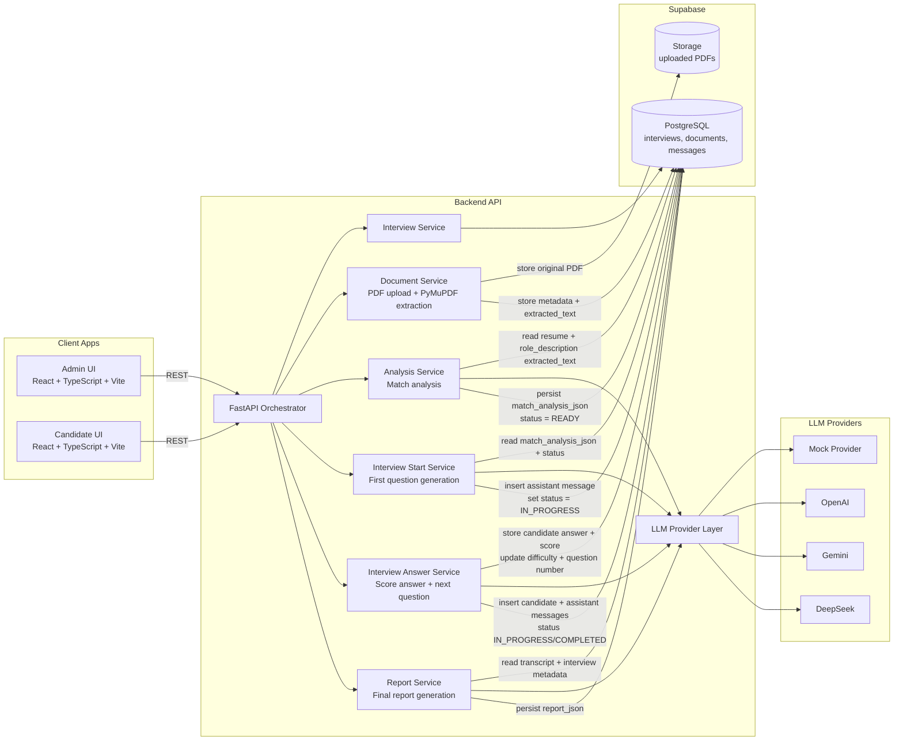
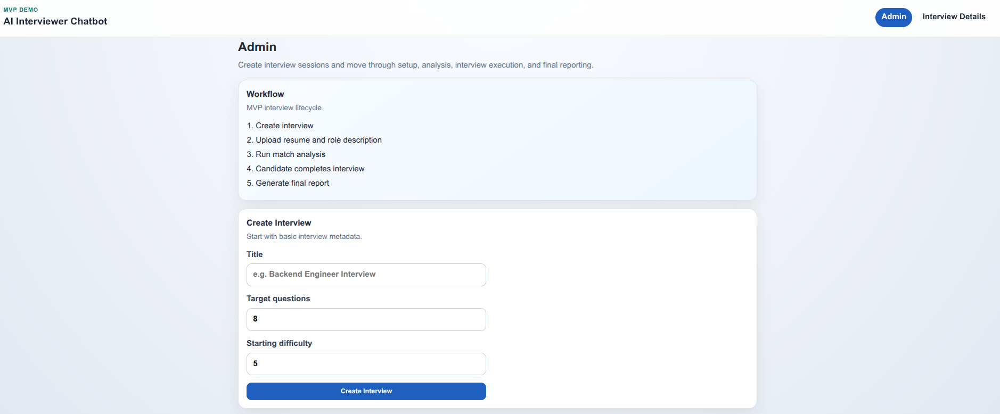
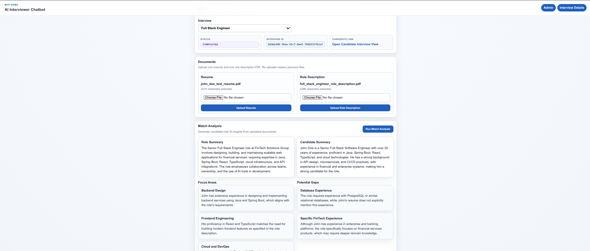

# AI Interviewer Chatbot (MVP)

A local-first MVP for running adaptive, AI-assisted technical interviews.

This project is being built step-by-step from the blueprint in `docs/AI-Interview-Chatbot-Blueprint 2.pdf`, using:

- Frontend: React + TypeScript + Vite
- Backend: FastAPI + Python
- Database: Supabase PostgreSQL
- Storage: Supabase Storage
- LLM: Pluggable multi-provider (Mock, OpenAI, Gemini, DeepSeek)

## Vision

The intended end-to-end flow is:

1. Admin creates interview
2. Admin uploads resume and role description
3. Backend extracts text and runs match analysis
4. Candidate starts interview session
5. System asks adaptive questions
6. Candidate answers are scored with a rubric
7. Difficulty adjusts over time
8. Final report is generated

This MVP emphasizes deterministic orchestration around LLM calls, structured JSON outputs, and persistence of interview transcripts and scoring metadata.


## Architecture (MVP)



## Repository Layout

```text
ai-interviewer-chatbot/
├── AGENTS.md
├── README.md
├── api/
│   ├── README.md
│   ├── requirements.txt
│   ├── .env.example
│   ├── Dockerfile
│   ├── .dockerignore
│   └── app/
│       ├── __init__.py
│       ├── main.py                  # FastAPI app setup, CORS, router includes
│       ├── schemas.py               # Backward-compat re-exports
│       ├── core/
│       │   ├── config.py            # pydantic-settings Settings
│       │   └── llm.py               # LLM provider factory
│       ├── domain/
│       │   └── interfaces/
│       │       └── llm_provider.py  # Abstract LLMProvider base
│       ├── application/
│       │   └── use_cases/
│       │       ├── analysis_service.py
│       │       ├── document_service.py
│       │       ├── interview_service.py
│       │       ├── interview_start_service.py
│       │       ├── interview_answer_service.py
│       │       ├── report_service.py
│       │       └── question_meta_store.py
│       ├── infrastructure/
│       │   ├── data/
│       │   │   └── supabase_client.py
│       │   └── llm/
│       │       ├── mock.py
│       │       ├── openai_provider.py
│       │       ├── gemini_provider.py
│       │       └── deepseek_provider.py
│       └── presentation/
│           ├── dependencies.py       # DI wire-up
│           ├── controllers/
│           │   ├── health.py         # GET /health
│           │   └── interviews.py     # All interview endpoints
│           └── schemas/
│               ├── analysis.py
│               ├── answer.py
│               ├── document.py
│               ├── health.py
│               ├── interview.py
│               ├── message.py
│               ├── question.py
│               └── report.py
├── frontend/
│   ├── README.md
│   ├── package.json
│   ├── .env.example
│   ├── Dockerfile
│   ├── .dockerignore
│   └── src/
│       ├── App.tsx
│       ├── components/ui.tsx
│       ├── api/client.ts
│       ├── pages/
│       └── styles.css
└── docs/
    ├── AI-Interview-Chatbot-Blueprint 2.pdf
    └── supabase_schema.sql
```

## Prerequisites

- Python 3.12+
- Node.js 18+
- npm 9+
- Docker & Docker Compose (for Option B)

## Quick Start (Local)

### Option A — Run directly

#### 1) Start the API

```bash
cd api
python -m venv .venv
source .venv/bin/activate
pip install -r requirements.txt
cp .env.example .env
uvicorn app.main:app --reload
```

API runs at: `http://localhost:8000`

Health check:

```bash
curl http://localhost:8000/health
```

Expected response:

```json
{"status":"ok"}
```

#### 2) Start the Frontend

Open a second terminal:

```bash
cd frontend
npm install
cp .env.example .env
npm run dev
```

Frontend typically runs at: `http://localhost:5173`

### Option B — Run with Docker (Step 10)

```bash
docker compose up --build
```

| Service   | URL                          |
|-----------|------------------------------|
| API       | `http://localhost:8000`      |
| Frontend  | `http://localhost:3000`      |

Before starting, ensure `api/.env` and `frontend/.env` exist on the host. They are mounted as read-only volumes at runtime — no secrets are baked into the image. The default `LLM_PROVIDER=mock` works without API keys.

Health check:

```bash
curl http://localhost:8000/health
```

## Quick Smoke Test (Steps 1-9)

Use this checklist to verify the MVP flow through final report generation.

1. Create interview:

```bash
curl -s -X POST http://localhost:8000/interviews \
  -H "Content-Type: application/json" \
  -d '{"title":"Smoke Test Interview","target_questions":1,"starting_difficulty":5}'
```

Copy the returned `id` as `INTERVIEW_ID`.

2. Upload resume + role description PDFs:

```bash
curl -s -X POST http://localhost:8000/interviews/INTERVIEW_ID/documents \
  -F "document_type=resume" \
  -F "file=@/absolute/path/to/resume.pdf;type=application/pdf"

curl -s -X POST http://localhost:8000/interviews/INTERVIEW_ID/documents \
  -F "document_type=role_description" \
  -F "file=@/absolute/path/to/role_description.pdf;type=application/pdf"
```

3. Verify uploaded metadata:

```bash
curl -s http://localhost:8000/interviews/INTERVIEW_ID/documents
```

Expected: one `resume` and one `role_description` entry with `filename` and `extracted_character_count`.

4. Run match analysis:

```bash
curl -s -X POST http://localhost:8000/interviews/INTERVIEW_ID/analyze
```

Expected: strict JSON (`role_summary`, `candidate_summary`, `focus_areas`, `potential_gaps`).

5. Confirm interview is READY:

```bash
curl -s http://localhost:8000/interviews/INTERVIEW_ID
```

Expected: `status` is `READY` and `match_analysis_json` is populated.

6. Start interview (Step 7):

```bash
curl -s -X POST http://localhost:8000/interviews/INTERVIEW_ID/start
```

Expected: `status` is `IN_PROGRESS` and response includes first question with:
- `content`
- `topic`
- `difficulty`
- `question_number=1`
- `expected_signals`

7. Verify transcript messages:

```bash
curl -s http://localhost:8000/interviews/INTERVIEW_ID/messages
```

Expected: at least one `assistant` message with `question_number=1`.

8. Submit one candidate answer (Step 8):

```bash
curl -s -X POST http://localhost:8000/interviews/INTERVIEW_ID/answer \
  -H "Content-Type: application/json" \
  -d '{"answer":"I would design resource-first APIs with validation, authz boundaries, and observability.","response_time_ms":32000,"paste_detected":false}'
```

Expected:
- If there are remaining questions: `status` is `IN_PROGRESS` and `next_question` is populated.
- If target is reached: `status` is `COMPLETED` and `next_question` is `null`.

Note: this smoke test uses `target_questions=1`, so the first answer should complete the interview.

9. Generate and fetch final report (Step 9):

```bash
curl -s -X POST http://localhost:8000/interviews/INTERVIEW_ID/report

curl -s http://localhost:8000/interviews/INTERVIEW_ID/report
```

Expected report fields:
- `summary`
- `overall_score`
- `strengths`
- `weaknesses`
- `integrity_notes`
- `recommendation`
- `recommendation_rationale`

Frontend smoke flow:

1. Open `/admin`, create interview, and go to interview details.
2. Upload resume and role description.
3. Click **Run Match Analysis**.
4. Open **Open Candidate Interview View**.
5. Click **Start Interview** and verify first question is displayed.
6. Submit answers until the interview reaches **COMPLETED**.
7. Return to **Interview Details** and click **Generate Report**.
8. Verify final report cards and transcript rendering.

## Environment Variables

### API (`api/.env`)

Based on `api/.env.example`:

- `SUPABASE_URL=`
- `SUPABASE_SERVICE_ROLE_KEY=`
- `LLM_PROVIDER=mock`
- `OPENAI_API_KEY=`
- `OPENAI_MODEL=gpt-4o-mini`
- `GOOGLE_API_KEY=`
- `GOOGLE_MODEL=gemini-2.0-flash`
- `DEEPSEEK_API_KEY=`
- `DEEPSEEK_MODEL=deepseek-chat`

Note: `LLM_PROVIDER=mock` is recommended for local MVP testing without external API credentials.

### Frontend (`frontend/.env`)

Based on `frontend/.env.example`:

- `VITE_API_URL=http://localhost:8000`

## Available Routes and Endpoints

### Backend

- `GET /health` -> returns service health
- `POST /interviews` -> creates interview
- `GET /interviews` -> lists interviews
- `GET /interviews/{interview_id}` -> fetches interview
- `DELETE /interviews/{interview_id}` -> deletes interview
- `POST /interviews/{interview_id}/documents` -> uploads PDF and returns extracted character count
- `GET /interviews/{interview_id}/documents` -> lists documents from `documents` table
- `GET /interviews/{interview_id}/documentsFromStorage` -> lists documents from Supabase Storage
- `DELETE /interviews/{interview_id}/documents/{filename}` -> deletes document from Storage + DB
- `POST /interviews/{interview_id}/analyze` -> triggers LLM match analysis and returns structured JSON
- `POST /interviews/{interview_id}/start` -> starts interview and returns first question
- `POST /interviews/{interview_id}/answer` -> stores answer, scores it, updates difficulty, and returns next question or completion
- `GET /interviews/{interview_id}/messages` -> returns interview transcript ordered by `created_at`
- `POST /interviews/{interview_id}/report` -> generates final report and persists it to `interviews.report_json`
- `GET /interviews/{interview_id}/report` -> returns persisted final report JSON

### Frontend

- `/admin`
- `/admin/interviews`
- `/admin/interviews/:id`
- `/interview`
- `/interview/:id`

## Product Workflow (Blueprint-Aligned)

Target state machine:

- `DRAFT` -> `READY` -> `IN_PROGRESS` -> `COMPLETED`

Implemented core workflows:

1. Create + analyze interview
2. Run adaptive interview loop
3. Generate final report

The implementation roadmap is defined in `AGENTS.md` (Steps 1-16).

## Development Notes

- Keep the MVP simple; avoid premature abstraction.
- Favor strict JSON contracts for LLM outputs.
- Persist transcripts and scoring metadata for report generation.
- Treat integrity signals (`response_time_ms`, `paste_detected`) as informational, not automatic disqualifiers.

## Documentation

- Blueprint: `docs/AI-Interview-Chatbot-Blueprint 2.pdf`
- Backend notes: `api/README.md`
- Frontend notes: `frontend/README.md`
- Step-by-step implementation plan: `AGENTS.md`

## Screens

### Admin / Interview Details



### Candidate Interview



## Next Milestones

Planned:

1. Step 11: Prepare droplet deployment approach (no deploy yet)
2. Step 14: Introduce LangGraph orchestration for interview workflow nodes
3. Step 15: Add LangChain monitoring/observability hooks
4. Step 16: Add CI pipelines to run tests and build Docker images

## Current document behavior

- Uploaded document filenames are normalized to `snake_case` before storing.
- Upload stores file in Supabase Storage and upserts metadata/content in `documents` table.
- Uploading a document for an existing type replaces the old document in both Storage and DB.

## LLM Provider Configuration

The backend supports multiple LLM providers. Configure them in `api/.env`:

- `LLM_PROVIDER`: `mock` | `openai` | `gemini` | `deepseek`
- **mock**: Requires no credentials, returns a fixed response for testing.
- **openai**: Requires `OPENAI_API_KEY`, uses `OPENAI_MODEL` (default: `gpt-4o-mini`).
- **gemini**: Requires `GOOGLE_API_KEY`, uses `GOOGLE_MODEL` (default: `gemini-2.0-flash`).
- **deepseek**: Requires `DEEPSEEK_API_KEY`, uses `DEEPSEEK_MODEL` (default: `deepseek-chat`).

## Current interview-start behavior

- `POST /interviews/{id}/start` only starts interviews in `READY` or returns latest assistant question for `IN_PROGRESS`.
- First question is generated from `match_analysis_json.focus_areas` via the selected LLM provider.
- Invalid generated question JSON returns `503` with `LLM returned invalid question JSON.`

## Current answer behavior

- `POST /interviews/{id}/answer` is accepted only for `IN_PROGRESS` interviews.
- Candidate answer is stored in `messages` with `role=candidate`, timing, and paste telemetry.
- Answer evaluation is generated via provider abstraction and validated with strict schema.
- Difficulty updates follow MVP rules: `score >= 7` => `+0.5`, `score <= 4` => `-0.5`, clamped to `3..10`.
- Response returns either next assistant question (`IN_PROGRESS`) or interview completion (`COMPLETED`).
- Invalid evaluation JSON returns `503` with `LLM returned invalid answer evaluation JSON.`

## Current report behavior

- `POST /interviews/{id}/report` is accepted only for `COMPLETED` interviews.
- `overall_score` is calculated in application code from candidate `answer_quality_score` values and rounded to one decimal.
- `integrity_notes` are calculated in application code from `paste_detected` and response-time-vs-length heuristics.
- LLM generates summary/strengths/weaknesses/recommendation fields and output is schema-validated.
- Invalid report JSON returns `503` with `LLM returned invalid report JSON.`
- `GET /interviews/{id}/report` returns persisted `report_json` or `404` if a report has not been generated yet.
